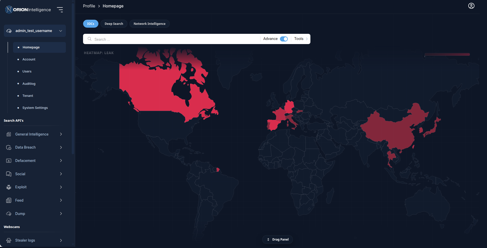

 

# Orion Platform

DOCUMENTATION  https://orion-search.readthedocs.io

 
Orion Platform is a comprehensive, web-based solution that combines the functionality of a browser, search engine, crawler, and data aggregation tools to empower OSINT (Open Source Intelligence) experts. Built on top of Docker, Orion provides a user-friendly interface to explore, search, and visualize data extracted by its powerful Orion Crawler.  

The platform integrates seamlessly with machine learning models, enhancing search relevance and enabling advanced
content analysis. Orion supports a broad range of functionalities, including the ability to search, filter, and
visualize data across multiple categories, making it an invaluable tool for data exploration and intelligence
gathering. 

Designed with flexibility and scalability in mind, Orion enables OSINT experts to feed data directly into the platform,
ensuring up-to-date and comprehensive datasets. Whether for investigative research, competitive analysis, or general
information gathering, Orion provides a unified ecosystem that enhances the workflow of professionals who rely on
actionable insights. 
 

## Platform Preview

The Orion homepage provides a search-first investigation workspace with summary panels, recent findings, and
visual pivots that help analysts move quickly from overview to deeper investigation.

## Getting Started

To explore the platform and project materials quickly:

1. Open the documentation: https://orion-search.readthedocs.io
2. Review the main platform repository: https://github.com/Orion-Intelligence/Orion-Intelligence
3. Explore the wider Orion module set in the tables below
4. Use the project documentation and repository modules to understand how collection, processing, and analyst workflows connect end to end

## Core Capabilities

Orion is built as an operational intelligence environment rather than a single search page. At a project level, the
platform is centered around:

- collection and ingestion from multiple sources
- processing, normalization, and enrichment of collected data
- indexing and retrieval for large investigative datasets
- analyst-facing search, filtering, and correlation workflows
- modular services that allow the ecosystem to expand as new investigative needs emerge

## Who It's For

Orion is intended for teams and individuals who need a unified investigation environment, including OSINT analysts,
research teams, cyber threat investigators, and operators who work across collection, search, enrichment, and review
workflows.

## Project Modules

The Orion ecosystem is composed of multiple connected repositories that together support the full intelligence
lifecycle. Some modules focus on collection, some on storage or microservices, some on presentation and analyst
experience, and others on specialized workflows such as browser-assisted acquisition or social-data handling.

At a high level, the project operates as a connected flow:

`Crawler / Collector -> Storage / Micros -> Orion Platform -> Browser / Social / Tor2Web / Landing`

## Technology Stack

The Orion platform is built using various technologies to provide optimal search capabilities and data handling. Below
is the list of libraries and frameworks used:

## Orion Modules

<table>
  <thead>
    <tr>
      <th>Module</th>
      <th>Layer</th>
      <th>Role</th>
      <th>Stats</th>
    </tr>
  </thead>
  <tbody>
    <tr>
      <td><a href="https://github.com/Orion-Intelligence/Orion-Intelligence"><strong>Orion Platform</strong></a></td>
      <td>Core</td>
      <td>Main analyst-facing platform for search, visualization, correlation, and investigation workflows.</td>
      <td> </td>
    </tr>
    <tr>
      <td><a href="https://github.com/Orion-Intelligence/Orion-Crawler"><strong>Orion Crawler</strong></a></td>
      <td>Collection</td>
      <td>Crawling engine for continuous acquisition from hidden-web and monitored sources.</td>
      <td> </td>
    </tr>
    <tr>
      <td><a href="https://github.com/Orion-Intelligence/Orion-Collector"><strong>Orion Collector</strong></a></td>
      <td>Collection</td>
      <td>Collector framework for custom source scripts and ingestion workflows.</td>
      <td> </td>
    </tr>
    <tr>
      <td><a href="https://github.com/Orion-Intelligence/Orion-Micros"><strong>Orion Micros</strong></a></td>
      <td>Services</td>
      <td>Modular backend services that support platform processing and integrations.</td>
      <td> </td>
    </tr>
    <tr>
      <td><a href="https://github.com/Orion-Intelligence/Orion-Storage"><strong>Orion Storage</strong></a></td>
      <td>Data</td>
      <td>Storage layer for persistence, retention, and supporting data services.</td>
      <td> </td>
    </tr>
    <tr>
      <td><a href="https://github.com/Orion-Intelligence/Orion-Leaks"><strong>Orion Leaks</strong></a></td>
      <td>Data</td>
      <td>Leak-oriented ingestion and handling module for exposed-data workflows.</td>
      <td> </td>
    </tr>
    <tr>
      <td><a href="https://github.com/Orion-Intelligence/Orion-Social"><strong>Orion Social</strong></a></td>
      <td>Data</td>
      <td>Social-data module for collection and processing in social intelligence workflows.</td>
      <td> </td>
    </tr>
    <tr>
      <td><a href="https://github.com/Orion-Intelligence/Orion-Browser"><strong>Orion Browser</strong></a></td>
      <td>Client</td>
      <td>Browser-assisted acquisition module for private browsing and live collection workflows.</td>
      <td> </td>
    </tr>
    <tr>
      <td><a href="https://github.com/Orion-Intelligence/Orion-Tor2Web"><strong>Orion Tor2Web</strong></a></td>
      <td>Access</td>
      <td>Tor-to-web bridge component for controlled access and connectivity support.</td>
      <td> </td>
    </tr>
    <tr>
      <td><a href="https://github.com/Orion-Intelligence/Orion-Intelligence-Landing"><strong>Orion Intelligence Landing</strong></a></td>
      <td>Web</td>
      <td>Public-facing landing layer for project presentation and entry-point messaging.</td>
      <td> </td>
    </tr>
  </tbody>
</table>
## Browser Support

Orion Browser is an Android application designed to provide a secure, private browsing experience by leveraging onion
routing technology. This browser empowers users to access hidden web content anonymously, unblock restricted sites, and
browse freely while safeguarding their online identity.

## Contribution

We welcome contributions to improve Orion Platform. If you'd like to contribute, please fork the repository and submit a
pull request.

### Steps to Contribute

1. Fork the repository.
2. Create a new feature branch (`git checkout -b feature-branch`).
3. Commit your changes (`git commit -m 'Add some feature'`).
4. Push to the branch (`git push origin feature-branch`).
5. Create a new Pull Request.

## License

Orion Platform is licensed under the [MIT License](LICENSE).

## Disclaimer

This project is intended for research purposes only. The authors of Orion Platform do not support or endorse illegal
activities, and users of this project are responsible for ensuring their actions comply with the law.

## GitHub Repository

GitHub Repository URL: [https://github.com/Orion-Intelligence/Orion-Intelligence](https://github.com/Orion-Intelligence/Orion-Intelligence)

## Project Information

https://www.canva.com/design/DAF8Sa8KkDE/1H8z3RVausdHIMcE98Kvfg/edit

## Documentation

https://orion-search.readthedocs.io/en/latest/app_docs/introduction_to_platform.html
