

  <h1>
    <picture>
      <source media="(prefers-color-scheme: dark)" srcset="client/src/assets/images/sidebar/search_nav_logo.png">
      <source media="(prefers-color-scheme: light)" srcset="client/src/assets/images/shared/logo-wide-light.svg">
      
    </picture>
  </h1>

  <h3>A unified investigation platform for OSINT and cyber intelligence.</h3>
  
Collect, search, enrich, correlate, visualize, and share intelligence from one analyst workspace.

  

    <a href="https://orion-search.readthedocs.io"><strong>Documentation</strong></a>
    &nbsp;·&nbsp;
    <a href="https://orion-search.readthedocs.io/en/latest/app_docs/user_manual.html"><strong>User guide</strong></a>
    &nbsp;·&nbsp;
    <a href="https://stats.uptimerobot.com/xV0BS3KMq7"><strong>Service status</strong></a>
  

  

    
    
    
    
    
  

  

    
    
    
    
    
    
    
    
  

---

## Overview

Orion Intelligence is a web-based platform that brings browser-assisted research, indexed search, crawling, data aggregation, enrichment, and analyst workflows into one operational environment. It is designed for investigations that need more than isolated lookup tools: analysts can move from discovery to correlation, reporting, case work, and controlled sharing without leaving the platform.

The wider Orion ecosystem adds specialized collectors, crawlers, social-intelligence services, AI assistance, and isolated workspace execution.

<table>
  <tr>
    <td width="50%" valign="top">
      <strong>OSINT analysts</strong>  
      Discover, filter, enrich, and pivot across public-source intelligence.
    </td>
    <td width="50%" valign="top">
      <strong>Threat-intelligence teams</strong>  
      Track breaches, actors, malware, infrastructure, exploits, and indicators.
    </td>
  </tr>
  <tr>
    <td width="50%" valign="top">
      <strong>Investigators and researchers</strong>  
      Build cases, connect entities, preserve artifacts, and produce reports.
    </td>
    <td width="50%" valign="top">
      <strong>Platform operators</strong>  
      Manage tenants, users, licenses, audit activity, integrations, and system settings.
    </td>
  </tr>
</table>

### Explore Orion

<table>
  <tr>
    <td width="50%" valign="top">
      <a href="#platform-preview"><strong>Platform preview →</strong></a>  
      See the primary analyst surfaces.
    </td>
    <td width="50%" valign="top">
      <a href="#core-capabilities"><strong>Core capabilities →</strong></a>  
      Understand what the platform provides.
    </td>
  </tr>
  <tr>
    <td width="50%" valign="top">
      <a href="#orion-ecosystem"><strong>Orion ecosystem →</strong></a>  
      Explore the connected Orion modules.
    </td>
    <td width="50%" valign="top">
      <a href="#security-licensing-and-responsible-use"><strong>Security, licensing, and responsible use →</strong></a>  
      Review the project boundaries.
    </td>
  </tr>
</table>

---

## Platform Preview

The homepage is a search-first investigation workspace with intelligence summaries, recent activity, geographic context, and direct pivots into deeper workflows.

  <a href="docs/screenshots/homepage-overview-20260326.png">
    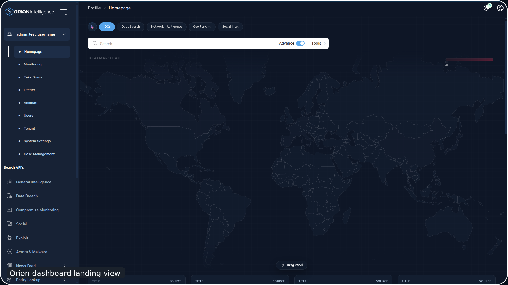
  </a>

  
<strong>Explore more platform screens</strong>

   
  <table>
    <tr>
      <td align="center" valign="top"><a href="docs/screenshots/consolidated-insights-20260326.png">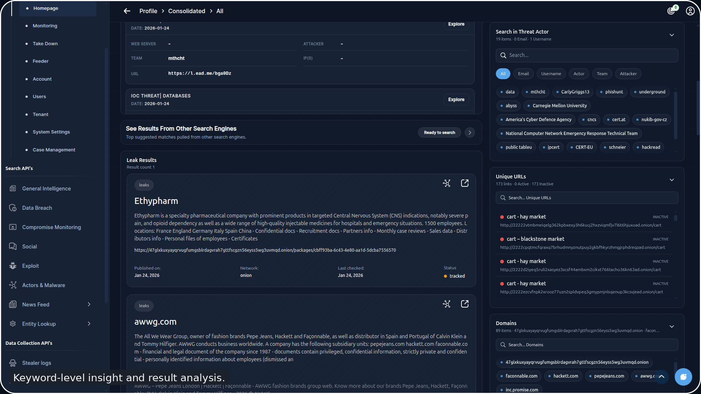</a> Consolidated intelligence</td>
      <td align="center" valign="top"><a href="docs/screenshots/cti-graph-20260326.png">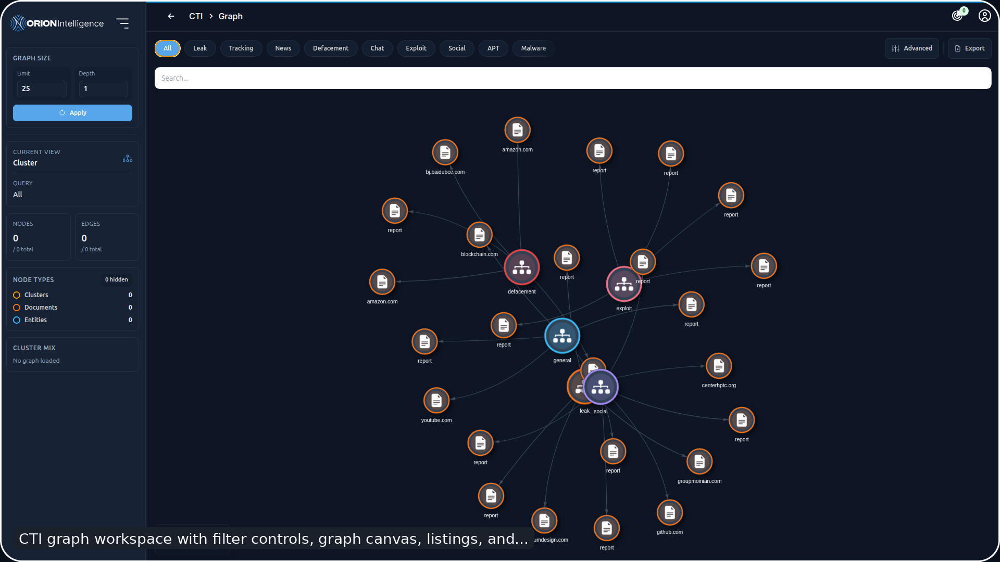</a> CTI graph analysis</td>
      <td align="center" valign="top"><a href="docs/screenshots/social-intel-20260326.png">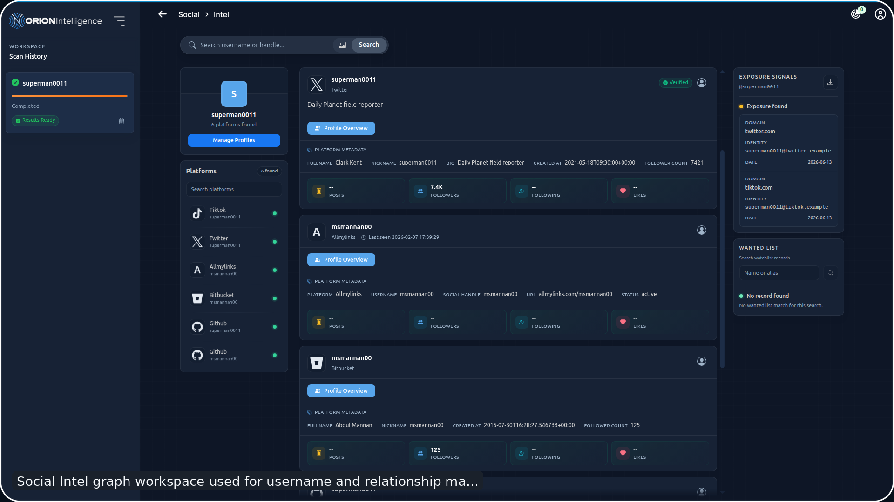</a> Social intelligence</td>
    </tr>
    <tr>
      <td align="center" valign="top"><a href="docs/screenshots/case-management-view-20260326.png">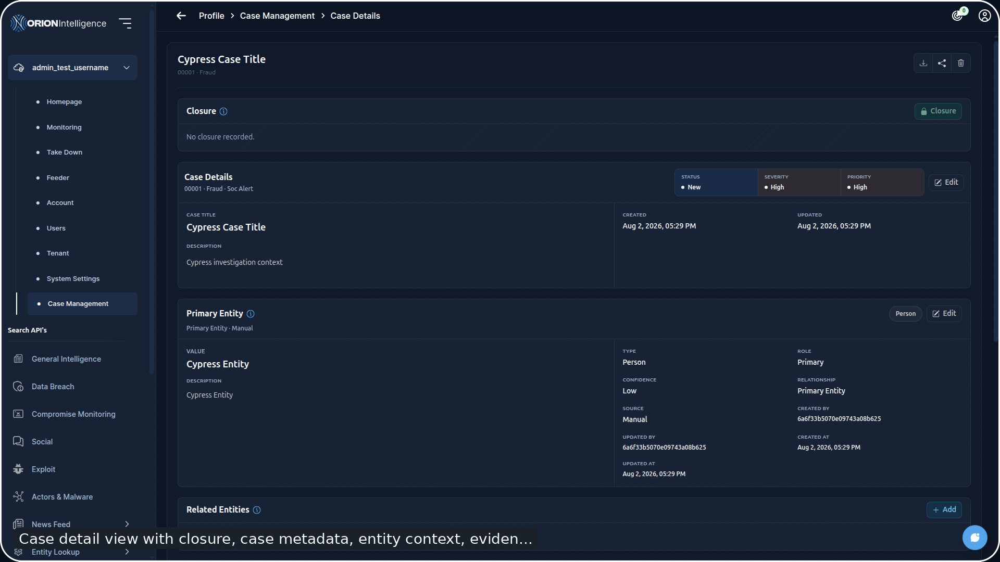</a> Case management</td>
      <td align="center" valign="top"><a href="docs/screenshots/satellite-map-overview-20260326.png">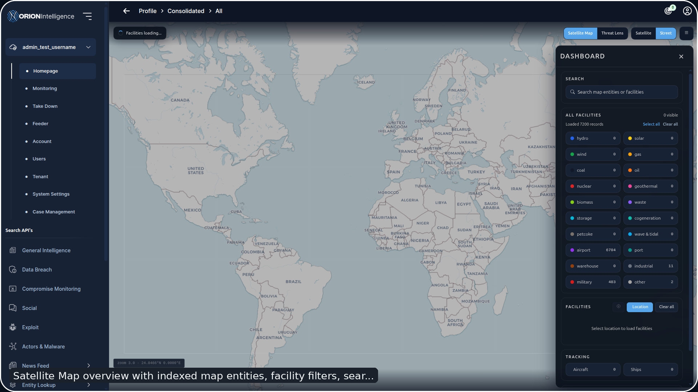</a> Satellite intelligence</td>
      <td align="center" valign="top"><a href="docs/screenshots/network-intel-host-recon-20260326.png">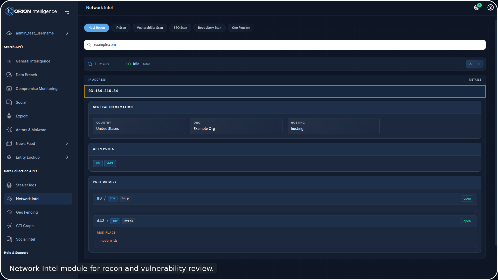</a> Network intelligence</td>
    </tr>
    <tr>
      <td align="center" valign="top"><a href="docs/screenshots/chat-share-public-view-20260326.png">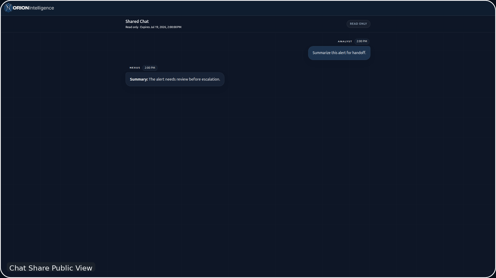</a> Controlled chat sharing</td>
      <td align="center" valign="top"><a href="docs/screenshots/tenant-administration-20260326.png">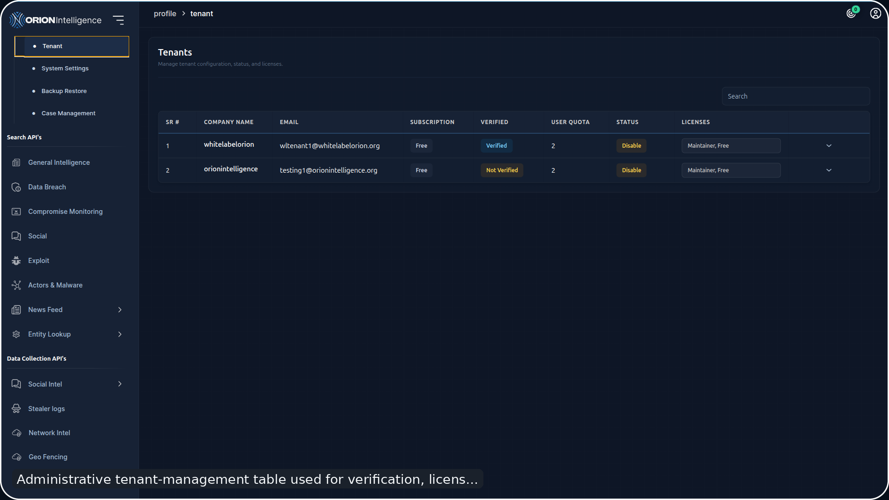</a> Tenant administration</td>
      <td align="center" valign="top"><a href="docs/screenshots/audit-logs-20260326.png">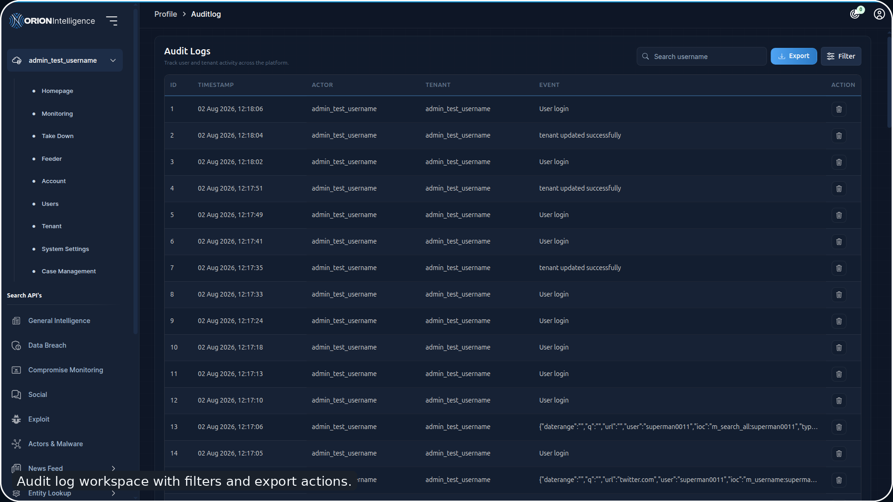</a> Audit and oversight</td>
    </tr>
  </table>
  
<a href="docs/screenshots"><strong>Browse all documentation screenshots →</strong></a>

---

## Core Capabilities

<table>
  <tr>
    <td width="50%" valign="top">
      <strong>Unified search</strong>  
      Search and filter indexed intelligence across breach, social, exploit, stealer-log, discussion, feed, and general-intelligence datasets.
    </td>
    <td width="50%" valign="top">
      <strong>Entity and network intelligence</strong>  
      Run entity lookups, host reconnaissance, IP and DNS analysis, vulnerability scans, and file or text analysis.
    </td>
  </tr>
  <tr>
    <td width="50%" valign="top">
      <strong>Correlation and visualization</strong>  
      Explore CTI and social graphs, consolidated findings, geographic heatmaps, satellite intelligence, and related entities.
    </td>
    <td width="50%" valign="top">
      <strong>AI-assisted analysis</strong>  
      Use Nexus chat and report assistance for summaries, triage, and investigation context, subject to deployment configuration.
    </td>
  </tr>
  <tr>
    <td width="50%" valign="top">
      <strong>Case operations</strong>  
      Create cases, preserve artifacts, track entities and tasks, move work through investigation stages, and produce reports.
    </td>
    <td width="50%" valign="top">
      <strong>Sharing and export</strong>  
      Generate structured exports and token-scoped, read-only public views for selected cases and chats.
    </td>
  </tr>
  <tr>
    <td width="50%" valign="top">
      <strong>Multi-tenant administration</strong>  
      Manage tenants, users, licenses, feature access, branding, alerts, integrations, audit logs, and system settings.
    </td>
    <td width="50%" valign="top">
      <strong>Extensible collection</strong>  
      Feed current data into Orion through crawlers, collectors, browser-assisted workflows, and adjacent Orion services.
    </td>
  </tr>
</table>

## How Orion Fits Together

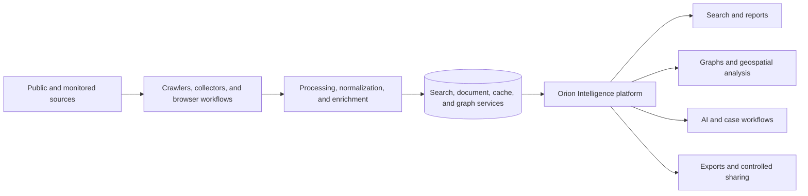

Orion Intelligence is the primary analyst-facing platform. Collection, AI, sandboxing, and specialist processing are supplied by the connected modules listed in the [Orion ecosystem](#orion-ecosystem).

---

## Orion Ecosystem

<table>
  <tr>
    <td width="50%" valign="top">
      <a href="https://github.com/Orion-Intelligence/Orion-Intelligence"><strong>Orion Intelligence</strong></a>  
      Analyst-facing investigation platform and API layer.
    </td>
    <td width="50%" valign="top">
      <a href="https://github.com/Orion-Intelligence/Orion-Dark-Nexus"><strong>Orion Dark Nexus</strong></a>  
      AI-assisted investigation, chat orchestration, and secure workspace management.
    </td>
  </tr>
  <tr>
    <td width="50%" valign="top">
      <a href="https://github.com/Orion-Intelligence/Orion-Sandbox"><strong>Orion Sandbox</strong></a>  
      Isolated execution infrastructure for untrusted workspace code.
    </td>
    <td width="50%" valign="top">
      <a href="https://github.com/Orion-Intelligence/Orion-Crawler"><strong>Orion Crawler</strong></a>  
      Hidden-web and monitored-source crawling engine.
    </td>
  </tr>
  <tr>
    <td width="50%" valign="top">
      <a href="https://github.com/Orion-Intelligence/Orion-Collector"><strong>Orion Collector</strong></a>  
      Framework for collecting data from custom sources.
    </td>
    <td width="50%" valign="top">
      <a href="https://github.com/Orion-Intelligence/Orion-Micros"><strong>Orion Micros</strong></a>  
      Supporting backend processing and service modules.
    </td>
  </tr>
  <tr>
    <td width="50%" valign="top">
      <a href="https://github.com/Orion-Intelligence/Orion-Browser"><strong>Orion Browser</strong></a>  
      Browser-assisted private collection workflows.
    </td>
    <td width="50%" valign="top">
      <a href="https://github.com/Orion-Intelligence/Orion-Social"><strong>Orion Social</strong></a>  
      Social-intelligence collection and analysis services.
    </td>
  </tr>
  <tr>
    <td width="50%" valign="top">
      <a href="https://github.com/Orion-Intelligence/Orion-Leaks"><strong>Orion Leaks</strong></a>  
      Leak-focused ingestion and handling.
    </td>
    <td width="50%" valign="top">
      <a href="https://github.com/Orion-Intelligence/Orion-Tor2Web"><strong>Orion Tor2Web</strong></a>  
      Tor-to-web access support.
    </td>
  </tr>
</table>

## Documentation

<table>
  <tr>
    <td width="50%" valign="top">
      <a href="https://orion-search.readthedocs.io"><strong>Documentation home →</strong></a>  
      Entry point for published Orion documentation.
    </td>
    <td width="50%" valign="top">
      <a href="https://orion-search.readthedocs.io/en/latest/app_docs/introduction_to_platform.html"><strong>Introduction →</strong></a>  
      Product purpose and high-level concepts.
    </td>
  </tr>
  <tr>
    <td width="50%" valign="top">
      <a href="https://orion-search.readthedocs.io/en/latest/app_docs/user_manual.html"><strong>User manual →</strong></a>  
      Analyst-facing workflows and feature guidance.
    </td>
    <td width="50%" valign="top">
      <a href="https://orion-search.readthedocs.io/en/latest/app_docs/security_documentation.html"><strong>Security documentation →</strong></a>  
      Security architecture and operational controls.
    </td>
  </tr>
</table>

---

## Security, Licensing, and Responsible Use

> [!IMPORTANT]
> This repository is distributed under the [Cybersage Technologies Commercial End-User License Agreement](LICENSE). It is not licensed under MIT.

> [!CAUTION]
> Report vulnerabilities through the process in [SECURITY.md](SECURITY.md); do not publish sensitive details in a public issue.

> [!NOTE]
> Orion is intended for authorized research, investigation, and defensive security work. Users are responsible for obtaining permission, protecting collected data, and complying with applicable law and policy.

Protect credentials, access tokens, private datasets, and customer information from unauthorized disclosure.

---

  <a href="https://github.com/Orion-Intelligence/Orion-Intelligence"><strong>GitHub</strong></a>
  &nbsp;·&nbsp;
  <a href="https://orion-search.readthedocs.io"><strong>Documentation</strong></a>
  &nbsp;·&nbsp;
  <a href="https://stats.uptimerobot.com/xV0BS3KMq7"><strong>Status</strong></a>
  &nbsp;·&nbsp;
  <a href="https://www.orionintelligence.org/collaboration"><strong>Collaboration</strong></a>

